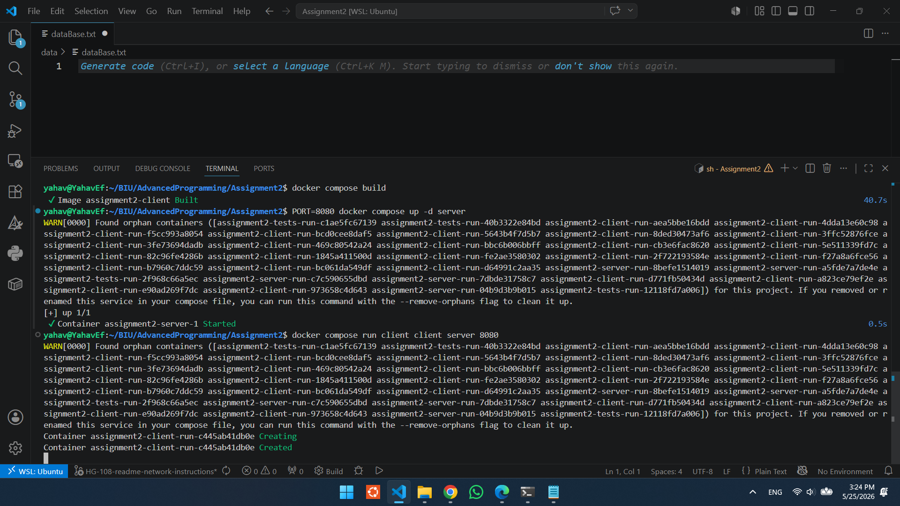
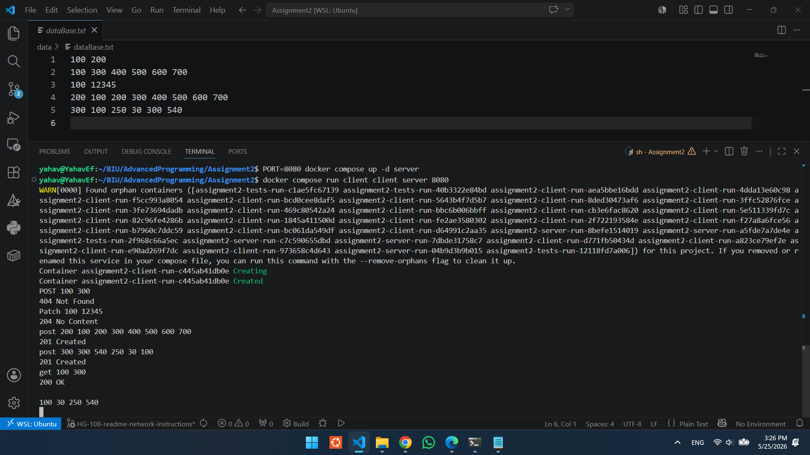
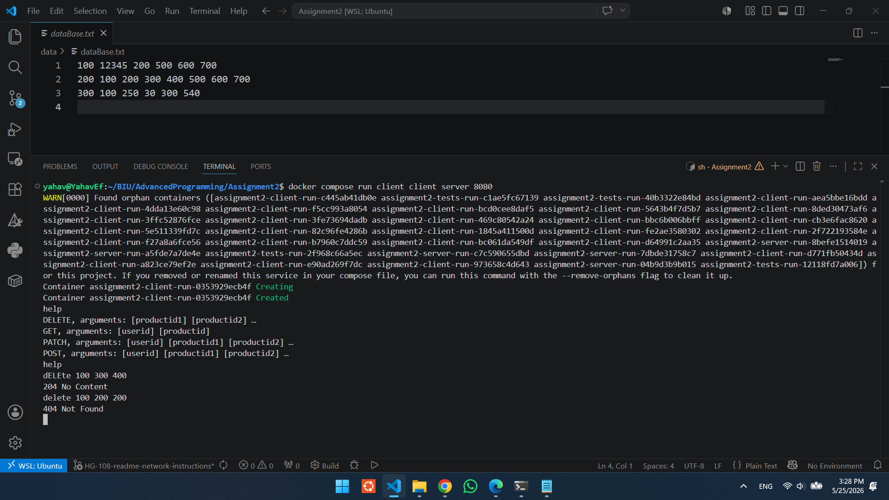

# Recommendation System - Client/Server Architecture - Assignment 2

## Project Description
This project was developed as part of the Advanced Programming course. In this stage of the assignment, we upgraded the recommendation system from Assignment 1 into a Client-Server application communicating over a TCP connection.
The system uses collaborative filtering to analyze user preferences and generate personalized product recommendations.

## Architecture Details
* **The Server (C++):** Handles all the core business logic, manages the database, and performs calculations. It listens for incoming requests over a TCP socket using a port passed as an argument.
* **The Client (Python 3):** Serves as the user interface. It takes commands from the user, sends them to the server via TCP, and prints the server's responses.

## Command Updates
We updated the system to support new network commands while maintaining the original logic:
* **POST:** Replaces the old `add` command. It adds a new user and product, but is only valid if the user did not exist before.
* **PATCH:** A new command that works similarly to `add`, but is only valid if the user already exists.
* **DELETE:** A new command used to remove a user's view history for specific products.
* **GET:** Replaces the old `recommend` command to return product recommendations.

## Preserving C++ Design Principles (SOLID & Open/Closed)
As requested in the assignment guidelines, we evaluated whether the new network and command requirements forced us to modify code that should be "closed to modification but open to extension". 

Thanks to our abstract design in Assignment 1, the core requirements did *not* strictly force us to violate the Open/Closed Principle. However, while analyzing the requirements, we recognized a much better architectural approach. We deliberately chose to refactor our command execution pipeline to a Request/Response model. While this required touching existing code, it significantly improved our Object-Oriented design, making it genuinely closed to modification for any future network changes.

**Addressing the specific architectural questions:**

* **Did the change in command names require touching closed code?**
  No. Command names are managed dynamically via a Command Factory. We simply registered the new network strings (e.g., mapping `GET` instead of `recommend`) without touching the internal execution logic of the commands.

* **Did adding new commands require touching closed code?**
  No. We utilized inheritance to extend functionality. To implement `POST` and `PATCH`, we inherited from the original `AddCommand` class. They execute the exact same core logic, and we only added their specific existence checks. `GET` similarly inherits from the original `RecommendCommand`.

* **Did the change in command outputs require touching closed code?**
  No. The new string formats (e.g., `201 Created` or `404 Not Found`) were encapsulated directly within the newly derived command classes, leaving the core algorithms untouched.

* **Did changing the I/O from console to sockets require touching closed code?**
  No. Because the original system was built with clear `IInput` and `IOutput` interfaces, the core logic is entirely unaware of the I/O medium. We simply implemented a new TCP network class that implements these interfaces.

* **Future Readiness (Handling Multiple Concurrent Clients):**
  Our decision to refactor to a Request/Response model directly prepares the server for future multi-client support. By encapsulating incoming data into a standalone `Request` object and returning a decoupled `Response` object, the command logic is now perfectly isolated. If required to handle multiple clients simultaneously in the future, our architecture is already fully decoupled and ready for safe multi-threading.

## Technologies & Tools
* **Programming Languages:** C++ for the Server and Python 3 for the Client.
* **Software Testing (TDD):** We developed the server logic using Test-Driven Development with the Google Test framework.
* **Build System:** CMake is used for straightforward project compilation.
* **Unified Environment:** Docker is used to containerize the server and client, ensuring a smooth build and execution process on any OS.

---
**<u>Build Instructions</u>** 

<u>1. Build the Project</u>
    First, open your terminal in the main project directory (where the docker-compose.yml is located) and build the Docker images:

        docker compose build
    
<u>2. Run the Server</u>
    To start the server, you need to provide a port. Because we use Docker Compose, the cleanest way to pass the port argument (and map the network correctly) is by specifying the PORT variable. Run this to start the server in the background:
        
        PORT=8080 docker compose up -d server
        
<u>3. Run the Client</u>
    Open a new terminal. To run the client interactively, you must provide the target IP and Port. Since both run on the same internal Docker network, the IP is simply the server's container name (server):
         
        docker compose run client client server 8080
   
    (for other ip run - docker compose run client client [IP] 8080)

<u>4. Stop the Server</u>
    The server runs continuously in the background. When you are done checking the project, use this command to safely stop and remove the containers:
         
        docker compose down

<u>5. Run the Unit Tests (optional)</u>
    If you want to run the GoogleTest suite instead of the main interactive program, use this command:
         
        docker compose run tests

<u>Compilation Example:</u>

<u>Run Example 1:</u>
in this example, we start with exsisting user (100) with some products, and using some commands (Post, Patch, GET)

<u>Run Example 2:</u>
in this example, we delete use Help and Delete form the prev Database (example1) 

